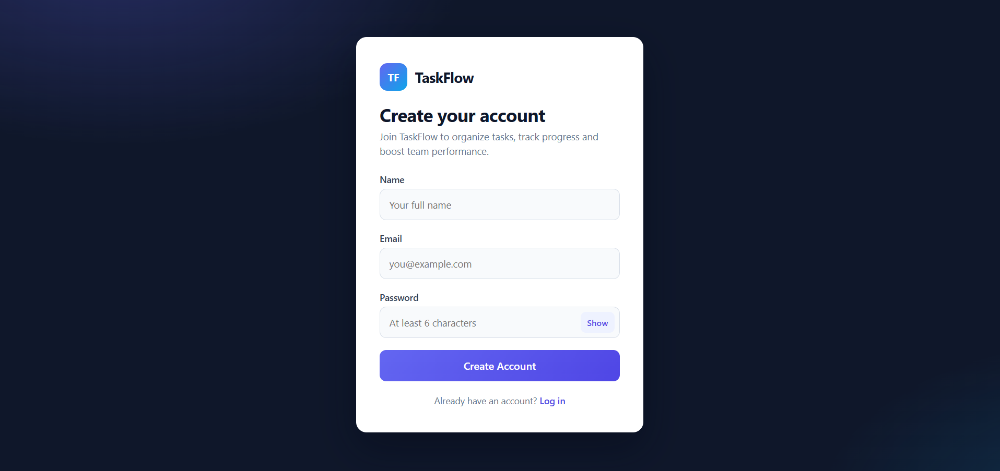
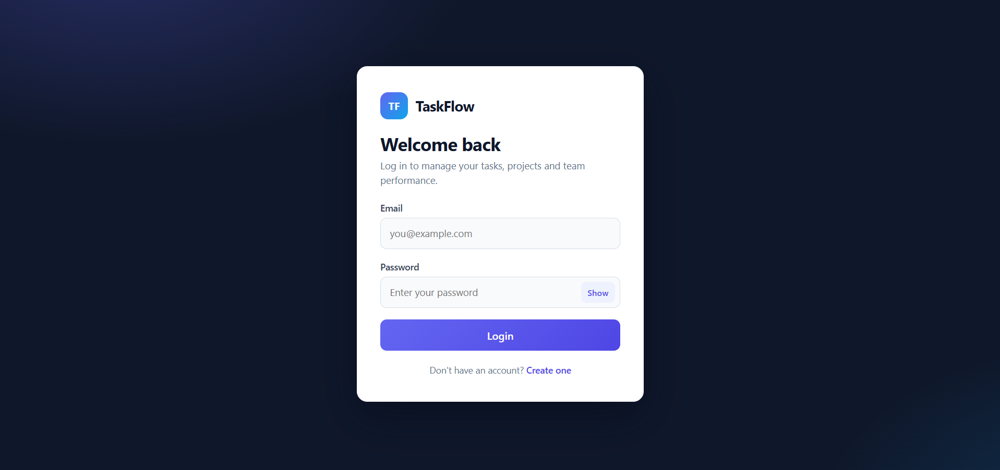
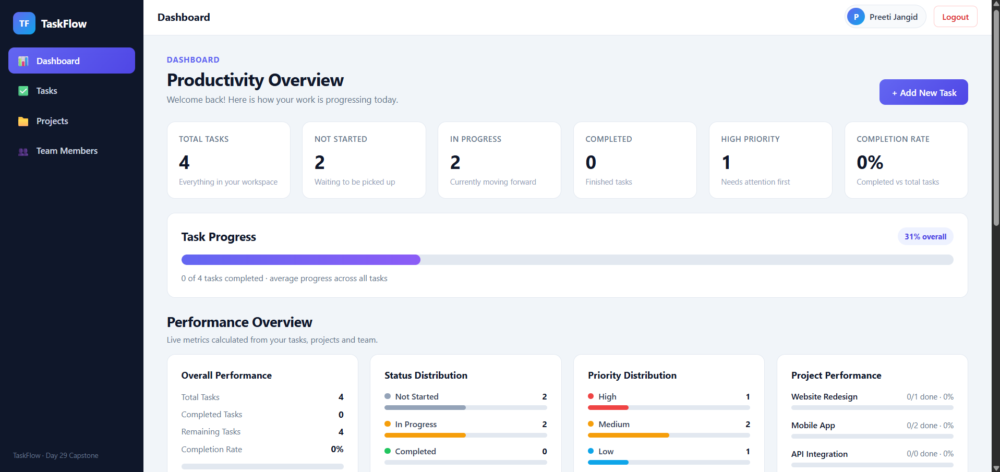
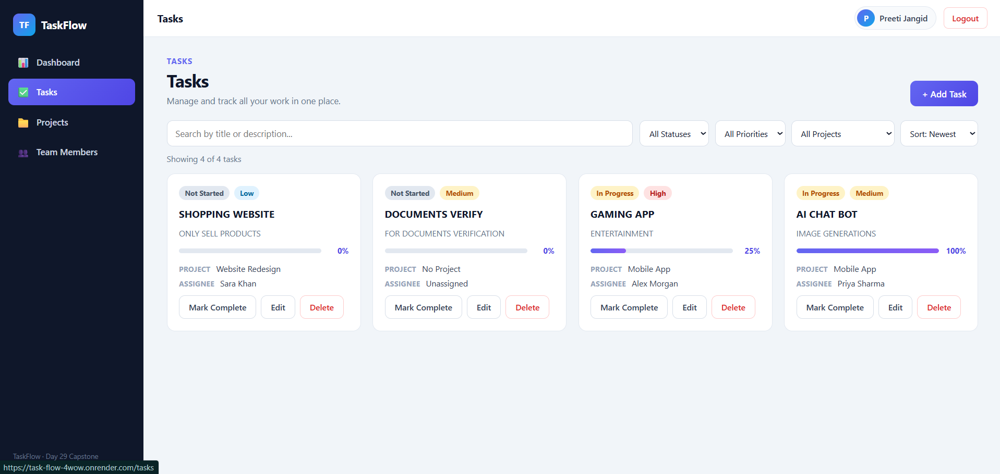
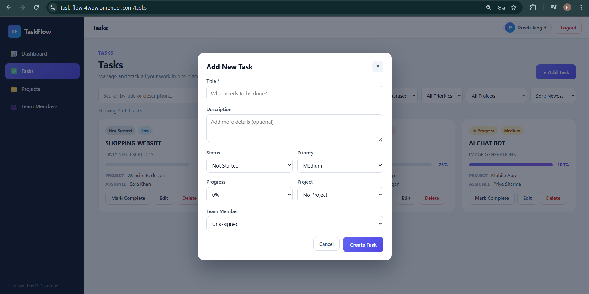
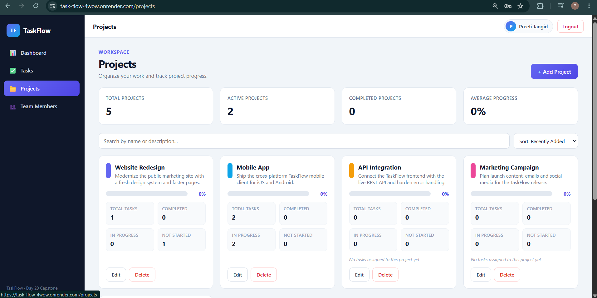
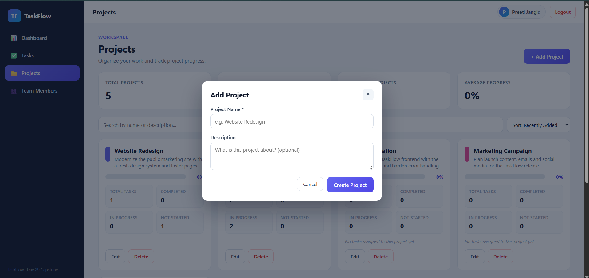
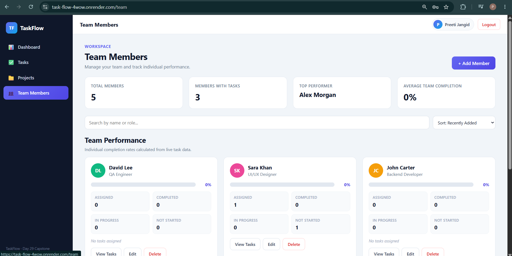
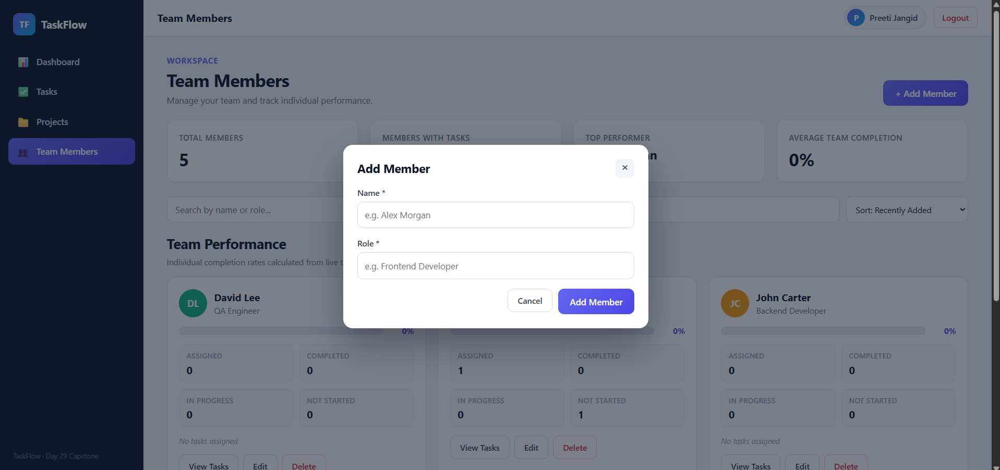

# TaskFlow

TaskFlow is a full-stack task management application built with the MEAN stack — MongoDB, Express, Angular, and Node.js.

It allows users to securely manage tasks, organize work into projects, manage team members, track progress, and quickly find tasks using search and filters.

TaskFlow was developed as the final capstone project of a 30-day MEAN Stack internship. The final integrated application is documented in Day 29 and Day 30.

---

## Live Application

- **Frontend:** https://task-flow-4wow.onrender.com
- **Backend API:** https://capstone-9pn7.onrender.com
- **API Base URL:** https://capstone-9pn7.onrender.com/api

The Angular frontend is deployed on Render and communicates with the deployed Express API.

> The backend is hosted on Render's free tier, so the first request after inactivity may take some time while the service starts.

---

## Features

### Authentication

- User registration and login
- JWT-based authentication
- Password hashing with bcrypt
- Protected routes
- JWT HTTP interceptor
- Logout functionality

### Dashboard

- Task overview
- Completion progress
- Recent tasks
- Status and priority summary

### Task Management

- Create, view, edit and delete tasks
- Task status: Not Started, In Progress, Completed
- Task priority: High, Medium, Low
- Search tasks
- Filter by status, priority and project
- Sorting
- Pagination
- Loading, error and empty states

### Projects

- Create, edit and delete projects
- Search and sort projects
- Project progress and statistics

### Team Members

- Add, edit and delete team members
- Search and sort members
- Assignment and completion information

### UI

- Responsive design
- Angular Material
- Reactive forms and validation
- Toast notifications
- Loading and empty states

> **Data note:** The deployed API provides authentication and task endpoints. Projects and team members are managed by the frontend and persisted in the browser.

---

## Tech Stack

| Area | Technologies |
|---|---|
| Frontend | Angular 21, TypeScript, SCSS, RxJS |
| UI | Angular Material |
| Routing | Angular Router |
| HTTP | Angular HttpClient |
| Forms | Reactive Forms |
| Backend | Node.js, Express 5 |
| Authentication | JWT, bcryptjs |
| Validation | express-validator |
| Database | MongoDB Atlas, Mongoose |
| Testing | Jest, Supertest, Vitest |
| Deployment | Render |

---

## Project Structure

The repository contains the complete 30-day internship development journey.

```text
mean-stack-intern-project-build/
│
├── Day-01(TASKFLOW-DOCUMENTATION)/
├── Day-02(TASKFLOW-DESIGN)/
├── Day-03(TASKFLOW-DATA)/
├── Day-04(TASKFLOW-SETUP)/
├── Day-05(TASKFLOW-NODE)/
├── ...
├── Day-24(API-TESTING-JEST-SUPERTEST)/
├── Day-25(API-DEPLOYMENT)/
├── Day-26(FE-LIVE-API-JWT)/
├── Day-27(CAPSTONE-BACKEND)/
├── Day-28(CAPSTONE-FEATURES)/
│
├── Day-29(CAPSTONE-INTEGRATE-POLISH)/
│   └── capstone-taskflow/
│
├── Day-30(FINAL-DEPLOYMENT-DEMO)/
│
├── Doc/
├── docs/
│   └── screenshots/
│
├── .gitignore
└── README.md
````

The final Angular application is located at:

```text
Day-29(CAPSTONE-INTEGRATE-POLISH)/capstone-taskflow/
```

---

## Local Setup

### Backend

Open the backend folder:

```bash
cd "Day-25(API-DEPLOYMENT)/api"
```

Install dependencies:

```bash
npm install
```

Create a `.env` file:

```env
PORT=5000
MONGO_URI=your-mongodb-connection-string
JWT_SECRET=your-secret-key
CLIENT_ORIGIN=http://localhost:4200
```

Start the development server:

```bash
npm run dev
```

Or:

```bash
npm start
```

### Frontend

Open the final Angular application:

```bash
cd "Day-29(CAPSTONE-INTEGRATE-POLISH)/capstone-taskflow"
```

Install dependencies:

```bash
npm install
```

Start Angular:

```bash
npm start
```

The application runs at:

```text
http://localhost:4200
```

For local backend development, the API URL can be configured as:

```text
http://localhost:5000/api
```

### Production Build

```bash
npm run build
```

---

## Environment Variables

The backend uses the following environment variables:

| Variable        | Purpose                             |
| --------------- | ----------------------------------- |
| `PORT`          | Express server port                 |
| `MONGO_URI`     | MongoDB connection string           |
| `JWT_SECRET`    | JWT signing and verification secret |
| `CLIENT_ORIGIN` | Allowed frontend origin for CORS    |

Real credentials and secrets must not be committed to GitHub.

---

## Testing

Backend API tests are available in:

```text
Day-24(API-TESTING-JEST-SUPERTEST)
```

Run:

```bash
cd "Day-24(API-TESTING-JEST-SUPERTEST)"
npm test
```

The backend test suite uses Jest, Supertest and an in-memory MongoDB database.

Verified result:

```text
Test Suites: 2 passed, 2 total
Tests:       18 passed, 18 total
```

The final Angular application also contains a Vitest testing setup:

```bash
cd "Day-29(CAPSTONE-INTEGRATE-POLISH)/capstone-taskflow"
npm test
```

A passing frontend test result is not claimed because it was not successfully verified during the final documentation update.

---

## API

### Base URL

```text
https://capstone-9pn7.onrender.com/api
```

Authenticated requests use:

```text
Authorization: Bearer <token>
```

### Authentication

| Method | Endpoint             | Purpose               |
| ------ | -------------------- | --------------------- |
| POST   | `/api/auth/register` | Register a user       |
| POST   | `/api/auth/login`    | Login and receive JWT |

### Tasks

| Method | Endpoint         | Purpose                        |
| ------ | ---------------- | ------------------------------ |
| GET    | `/api/tasks`     | Get authenticated user's tasks |
| GET    | `/api/tasks/:id` | Get a task                     |
| POST   | `/api/tasks`     | Create a task                  |
| PUT    | `/api/tasks/:id` | Update a task                  |
| DELETE | `/api/tasks/:id` | Delete a task                  |

### Health Check

```text
GET https://capstone-9pn7.onrender.com/
```

---

## Application Walkthrough

1. **Register** — Create an account using name, email and password.
2. **Login** — Login with the registered credentials and receive a JWT.
3. **Dashboard** — View task totals, progress, recent tasks and status information.
4. **Create Task** — Create a task with title, description, status, priority, project and assignee information.
5. **Edit Task** — Update an existing task and save the changes.
6. **Delete Task** — Remove an existing task.
7. **Search & Filter** — Search tasks and filter them by status, priority and project.
8. **Projects** — Create and manage projects and view project progress.
9. **Team Members** — Add and manage team members and view assignment information.

---

## Screenshots

Screenshots are stored in:

```text
docs/screenshots/
```

### Register



### Login



### Dashboard



### Tasks



### Add Task



### Projects



### Add Project



### Team Members



### Add Member



---

## 30-Day Development Journey

### Days 1–5 — Planning & Setup

* TaskFlow requirements and user stories
* UI and entity design
* JSON data structures
* GitHub repository setup
* Node.js sample data script

### Days 6–10 — Angular Foundations

* Angular standalone application
* Task list and task card
* In-memory task service
* Routing and navigation
* Reactive forms and validation

### Days 11–15 — Frontend Features

* HttpClient and REST integration
* RxJS search and filtering
* Custom pipe and directive
* Authentication guard
* Angular Material UI

### Days 16–20 — Backend

* Express server
* Task REST API
* Project routes
* Validation and error handling
* JWT authentication

### Days 21–25 — Database & Testing

* MongoDB Atlas
* Mongoose models
* MongoDB integration
* Jest and Supertest testing
* Render API deployment

### Days 26–28 — Integration

* Angular connected to live API
* JWT storage and interceptor
* Real task CRUD
* Projects and filtering
* Pagination and empty states

### Days 29–30 — Final Capstone

* End-to-end integration
* Bug fixes
* UI polish
* README and screenshots
* Production build
* Frontend deployment
* Final demo

---

## Security

TaskFlow includes:

* bcrypt password hashing
* JWT authentication
* JWT expiry
* Protected API routes
* Angular route guards
* HTTP authentication interceptor
* Request validation
* CORS configuration
* Environment-based secrets
* Gitignored `.env` files

---

## Deployment

### Frontend

[https://task-flow-4wow.onrender.com](https://task-flow-4wow.onrender.com)

### Backend

[https://capstone-9pn7.onrender.com](https://capstone-9pn7.onrender.com)

### Database

MongoDB Atlas is used for persistent backend data.

Production credentials are provided through environment variables and are not stored in the repository.

---

## Author

**Preeti Jangid**

B.Tech — Computer Science and Engineering

GitHub: [https://github.com/preetijangid-hub](https://github.com/preetijangid-hub)

Repository: [https://github.com/preetijangid-hub/mean-stack-intern-project-build](https://github.com/preetijangid-hub/mean-stack-intern-project-build)